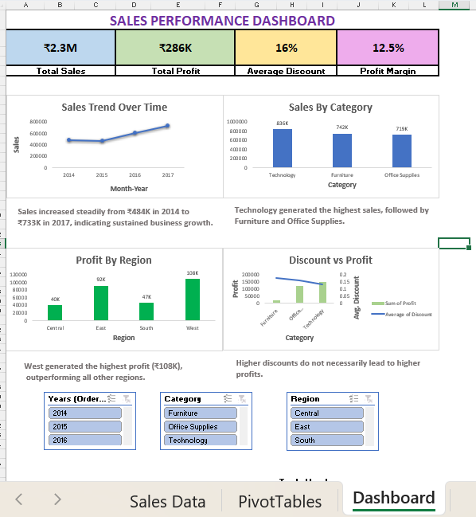

Sales Performance Analysis using SQL, Python & Excel Dashboard
Project Overview

This project analyzes retail sales data to identify trends, profitability drivers, and category performance. The analysis was performed using SQL and Python, and the findings were presented through an interactive Excel dashboard.

Objectives
Analyze sales and profit performance
Identify top-performing product categories
Evaluate regional profitability
Understand the impact of discounts on profit
Build an interactive dashboard for business reporting

Tools Used
SQL
Python
Pandas
Matplotlib
Jupyter Notebook
Microsoft Excel
Pivot Tables & Pivot Charts
Dataset

The dataset contains retail sales information including:

Order Date
Sales
Profit
Discount
Category
Region
Segment
Analysis Performed
SQL Analysis
Monthly Sales Trend
Sales by Category
Profit by Region
Average Discount by Category
Running Total Sales
Top Loss-Making Products
Python Visualization
Sales Trend Analysis
Category-wise Sales Distribution
Regional Profit Analysis
Discount vs Profit Relationship
Excel Dashboard

The dashboard includes:

Total Sales KPI
Total Profit KPI
Average Discount KPI
Profit Margin KPI
Sales Trend Chart
Sales by Category Chart
Profit by Region Chart
Discount vs Profit Analysis
Interactive Slicers

Key Insights

Technology generated the highest sales (₹836K).
West region recorded the highest profit (₹108K).
Sales increased consistently from 2014 to 2017.
Higher discounts did not necessarily lead to higher profits.
Furniture received the highest discount but generated the lowest profit.

Dashboard Preview

